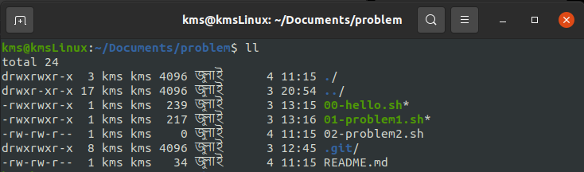

## What is Bash

## What is Shell

## Change the file permission

Initially the files are not executable. For this we need to make it executable by using the command bellow.

`chmod +x 02-problem2.sh`

## Run the script

`./hello.sh`
